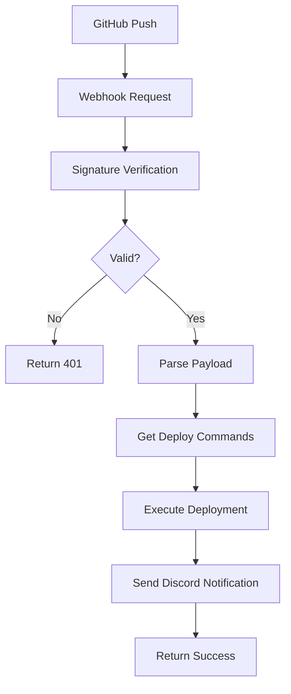

# 🚀 Webhook CI/CD - Hướng dẫn và Best Practices

## 📋 Tổng quan

Webhook này được thiết kế để xử lý GitHub webhooks một cách an toàn và hiệu quả, hỗ trợ deploy tự động cho nhiều loại project khác nhau.

## 🔐 Bảo mật và Signature Verification

### ✅ Những gì đã implement đúng chuẩn:

#### 1. **Payload Integrity Check**
```go
// ✅ ĐÚNG: Đọc raw body trước, verify signature, sau đó mới parse JSON
body, err := io.ReadAll(r.Body)
if !verifySignature(r, body) {
    return unauthorized
}
json.Unmarshal(body, &payload)
```

#### 2. **Header Signature Compatibility**
```go
// ✅ ĐÚNG: Check cả 2 headers phổ biến
signature := r.Header.Get("X-Hub-Signature-256")
if signature == "" {
    signature = r.Header.Get("X-GitHub-Signature-256")
}
```

#### 3. **HMAC Verification**
```go
// ✅ ĐÚNG: Xử lý đúng format và sử dụng constant-time comparison
func checkSignature(payload []byte, signature, secret string) bool {
    if strings.HasPrefix(signature, "sha256=") {
        signature = signature[7:]
    }
    
    mac := hmac.New(sha256.New, []byte(secret))
    mac.Write(payload)
    expectedMAC := hex.EncodeToString(mac.Sum(nil))
    
    return hmac.Equal([]byte(signature), []byte(expectedMAC))
}
```

#### 4. **Secret Sanitization**
```go
// ✅ ĐÚNG: Trim whitespace để tránh lỗi dấu cách thừa
func getEnv(key, defaultValue string) string {
    if value := os.Getenv(key); value != "" {
        return strings.TrimSpace(value)
    }
    return defaultValue
}
```

## 🔧 Cấu hình CI/CD

### Environment Variables Required:
```bash
# Cấu hình cơ bản
PORT=8300
WEBHOOK_SECRET=your_secret_here
DISCORD_WEBHOOK=https://discord.com/api/webhooks/...

# Cấu hình global (chỉ cần cho non-Docker projects)
# WORK_DIR=/path/to/your/project

# Cấu hình per-project
DEPLOY_COMMANDS_OWNER_REPO_NAME=command1;command2;command3
WORK_DIR_OWNER_REPO_NAME=/path/to/project
```

### Format Repository Name:
```
GitHub Repo: owner/repo-name
Env Variable: DEPLOY_COMMANDS_OWNER_REPO_NAME
```

## 📁 Cấu trúc Project Types Supported

### 1. **Go Projects**
```bash
# API Server
DEPLOY_COMMANDS_COMPANY_GO_API=git pull origin main;go mod tidy;go test ./...;go build -o api-server;sudo systemctl restart go-api

# Microservice with Docker
DEPLOY_COMMANDS_USER_GO_MICROSERVICE=git pull origin main;go mod download;CGO_ENABLED=0 go build -ldflags="-w -s" -o microservice;docker build -t microservice .;docker stop microservice || true;docker run -d --name microservice -p 8081:8080 microservice
```

### 2. **Node.js Projects**
```bash
# React Frontend
DEPLOY_COMMANDS_COMPANY_FRONTEND=git pull origin main;npm ci;npm run build;rsync -av --delete build/ /var/www/html/;sudo systemctl restart nginx

# Next.js App
DEPLOY_COMMANDS_COMPANY_NEXTJS_APP=git pull origin main;npm ci;npm run build;pm2 restart nextjs-app
```

### 3. **Python Projects**
```bash
# Django App
DEPLOY_COMMANDS_USER_DJANGO_APP=git pull origin main;pip install -r requirements.txt;python manage.py collectstatic --noinput;python manage.py migrate;sudo systemctl restart django-app

# FastAPI
DEPLOY_COMMANDS_USER_FASTAPI=git pull origin main;pip install -r requirements.txt;sudo systemctl restart fastapi
```

### 4. **Docker Projects**
```bash
# Docker Compose
DEPLOY_COMMANDS_COMPANY_MICROSERVICES=git pull origin main;docker-compose down;docker-compose build;docker-compose up -d

# Single Container
DEPLOY_COMMANDS_USER_DOCKER_APP=git pull origin main;docker build -t my-app .;docker stop my-app || true;docker rm my-app || true;docker run -d --name my-app -p 3000:3000 my-app
```

## 🚨 Tránh các lỗi thường gặp

### 1. **Payload Consistency**
```
❌ SAI: Parse JSON trước → Serialize lại → Verify signature
✅ ĐÚNG: Đọc raw body → Verify signature → Parse JSON
```

### 2. **Header Names**
```
❌ SAI: Chỉ check 1 header
✅ ĐÚNG: Check cả X-Hub-Signature-256 và X-GitHub-Signature-256
```

### 3. **Secret Management**
```
❌ SAI: Để secret có dấu cách/xuống dòng
✅ ĐÚNG: Trim whitespace từ environment variable
```

### 4. **Signature Format**
```
❌ SAI: So sánh trực tiếp với "sha256=..."
✅ ĐÚNG: Remove prefix "sha256=" trước khi verify
```

## 🔄 Workflow Process



## 📝 Deployment Commands Format

### Command Separator:
```bash
# Dùng dấu ; để ngăn cách commands
DEPLOY_COMMANDS_=cmd1;cmd2;cmd3
```

### Best Practices:
1. **Always pull latest code first**: `git pull origin main`
2. **Install dependencies**: `npm ci`, `go mod tidy`, `pip install -r requirements.txt`
3. **Run tests** (optional): `npm test`, `go test ./...`
4. **Build application**: `npm run build`, `go build`
5. **Restart services**: `systemctl restart`, `pm2 restart`

## 🎯 Security Checklist

- [x] HMAC signature verification
- [x] Raw payload verification
- [x] Header compatibility check
- [x] Secret sanitization
- [x] Rate limiting middleware
- [x] Request logging
- [x] Async deployment execution
- [x] Error handling and logging

## 📊 Monitoring & Logging

### Log Format:
```
[2024-01-01 15:04:05] POST /deploy from 192.168.1.100
Received webhook for repository: owner/repo, ref: refs/heads/main
Starting deployment for owner/repo
Executing: git pull origin main
Request completed in 2.5s
```

### Discord Notifications:
- ✅ Deployment success
- ❌ Deployment failure
- 📋 Commit info và repository details

## 🚀 Usage Example

### 1. Setup Environment:
```bash
export WEBHOOK_SECRET="your_secret_here"
export DISCORD_WEBHOOK="https://discord.com/api/webhooks/..."
export DEPLOY_COMMANDS_MYORG_MYREPO="git pull origin main;npm ci;npm run build;pm2 restart myapp"
export WORK_DIR_MYORG_MYREPO="/opt/myproject"
```

### 2. Start Webhook:
```bash
go run main.go
```

### 3. Configure GitHub Webhook:
- URL: `https://yourdomain.com/deploy`
- Content-type: `application/json`
- Secret: `your_secret_here`
- Events: `Just the push event`

## 🔍 Troubleshooting

### Common Issues:

1. **Invalid signature**: Check secret và payload format
2. **No deploy commands**: Verify environment variable naming
3. **Permission denied**: Check user permissions cho deploy commands
4. **Working directory not found**: Verify WORK_DIR path exists

---

## 📞 Support

Nếu gặp vấn đề, check logs và verify:
1. Environment variables
2. Secret configuration
3. GitHub webhook settings
4. Server permissions 